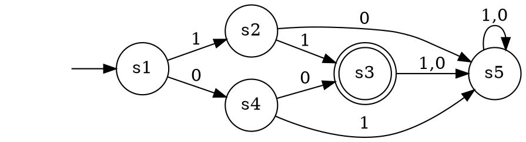
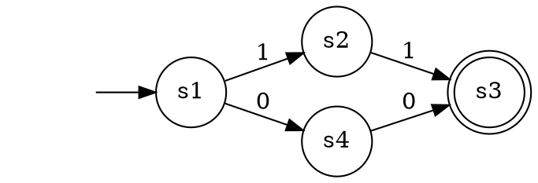

This library was created for the course IB110 - Introduction to Informatics at [MUNI FI](https://www.fi.muni.cz/).

# FINITE AUTOMATA

This library supports **deterministic** and **nondeterministic** finite automata. You can find the implementation of these models in the module **automaton**. Consider class **FA** as abstract, its only purpose is to avoid duplicities in the implementation of these models.

### Deterministic finite automata (DFA)

The implementation for the DFA can be found in the file **dfa.py** with a description of each function.

#### Example use-case of DFA:



A nested dictionary of type **DFATransitions** represents the transition function. The keys of this dictionary are states of the automaton, and values are dictionaries with input symbols as keys and the next state as values.

```python
from ib110hw.automaton.dfa import DFA, DFATransitions

dfa_transitions: DFATransitions = {
    "s1": { 
        "1": "s2", 
        "0": "s4" 
    },
    "s2": { 
        "1": "s3", 
        "0": "s5" 
    },
    "s3": { 
        "1": "s5", 
        "0": "s5" 
    },
    "s4": { 
        "1": "s5", 
        "0": "s3" 
    },
    "s5": { 
        "1": "s5", 
        "0": "s5" 
    },
}

automaton = DFA(
    states={"s1", "s2", "s3", "s4", "s5" },
    alphabet={"1", "0"},
    initial_state="s1",
    final_states={"s3"},
    transitions=dfa_transitions,
)

automaton.is_accepted("11") # True
automaton.is_accepted("00") # True
automaton.is_accepted("10") # False
```

### Nondeterministic finite automata (NFA)

The implementation for the NFA can be found in the file **nfa.py** with a description of each function.

#### Example use-case of NFA:



The transition function is represented almost the same way as in DFA. Instead of the next-state string, there is a **set** of next-state strings. The type of the NFA transition function is **NFATransitions**.

```python
from ib110hw.automaton.nfa import NFA, NFATransitions

nfa_transitions: NFATransitions = {
    "s1": { 
        "1": { "s2" }, 
        "0": { "s4" }, 
    },
    "s2": { 
        "1": { "s3" }, 
    },
    "s4": { 
        "0": { "s3" }, 
    },
}

automaton = NFA(
    states={"s1", "s2", "s3", "s4", "s5" },
    alphabet={"1", "0"},
    initial_state="s1",
    final_states={"s3"},
    transitions=nfa_transitions,
)

automaton.is_accepted("11") # True
automaton.is_accepted("00") # True
automaton.is_accepted("10") # False
```

# TURING MACHINE
This library supports a **deterministic** Turing machine. You can find the implementation in the module **turing**.
## Tape
The implementation of the tape for the Turing machine can be found in the file **tape.py**. 

```python
from ib110hw.turing.tape import Tape

tape: Tape = Tape()
tape.write("Hello") 
print(tape)         # | H | e | l | l | o |   |
                    #   ^

tape.move_left()    
print(tape)         # |   | H | e | l | l | o |   |
                    #   ^
                    
tape.move_right()
tape.move_right()
print(tape)         # |   | H | e | l | l | o |   |
                    #           ^  
                    
tape.current.value = "a"
print(tape)         # |   | H | a | l | l | o |   |
                    #           ^  
                    
tape.clear()        # |   |
                    #   ^

```
## Turing Machine
The following turing machine checks whether the input contains substring "101":
```python
from ib110hw.turing.deterministic_machine import DTM, DeterministicTransitions
from ib110hw.turing.tape import Direction

fn: DeterministicTransitions = {
    "init": {
        ">": ("findFst1", ">", Direction.RIGHT)
    },
    "findFst1": {
        "0": ("findFst1", "0", Direction.RIGHT),
        "1": ("find0", "1", Direction.RIGHT),
    },
    "find0": {
        "0": ("findSnd1", "0", Direction.RIGHT),
        "1": ("findFst1", "1", Direction.RIGHT),
    },
    "findSnd1": {
        "1": ("accept", "1", Direction.RIGHT),        
        "0": ("findFst1", "0", Direction.RIGHT),
    }
}

# setting tape is optional
turing = DTM(
    states={ "init", "findFst1", "find0", "findSnd1" },
    acc_states={ "accept" },
    rej_states=set(),
    initial_state="init",
    input_alphabet={ "0", "1" },
    transition_function=fn)

turing.tape.write(">01100101011")
```
### Simulation
You can simulate the turing machine using the provided function `simulate(...)`. By default, every step of the Turing machine will be printed to console with 0.5s delay inbetween. This behaviour can be changed by setting the `to_console` and `delay` parameters. If the parameter `to_console` is set to `False`, the delay will be ignored.

```python
turing.simulate(to_console=True, delay=0.3) # True
```

If you want to look at the whole history, you can set parameter `to_file` to `True`. Every step will be printed to file based on the path provided in the parameter `path`. Default path is set to `./simulation.txt`.
```python
turing.simulate(to_console=False, to_file=True, path="~/my_simulation.txt") # True
```

The `TuringMachine` class contains the attribute `max_steps` to avoid infinite looping. By default, it is set to 100. The calculation will halt if the simulation exceeds the value specified by this attribute. This can be an issue on larger inputs, so setting it to a bigger number may be needed.
```python
turing.max_steps = 200
```


